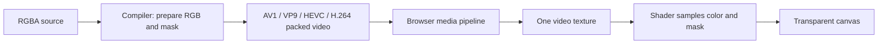

# aval-alpha: analysis and implementation plan

Follow-up implemented: dedicated React and Svelte packages use an optional shared
binding in the alpha package. See the [framework contract](../../alpha/frameworks.md)
and [package design](../specs/2026-09-04-alpha-framework-packages-design.md).

Date: 2026-09-04
Status: implemented as a 0.1 preview. Local compiler, browser, size and packaging
checks pass; real-device qualification remains open. See
[implementation evidence](../../alpha/verification.md) for results and limits.

## Recommendation

Build a standalone, dependency-free browser package around **HTMLVideoElement + a small WebGL compositor**, and add a separate video compilation mode to the existing compiler. Encode color and a grayscale alpha mask into the same video frame, using ordinary AV1/MP4, VP9/WebM, or HEVC/MP4. Include H.264/MP4 in the compatibility output preset.

HEVC here means ordinary **libx265-encoded opaque video containing a picture and a mask**. Transparency is reconstructed by our renderer. The design does not depend on Apple's native HEVC-with-alpha profile, `hevc_videotoolbox`, or macOS compilation. The user's experience with unreliable native HEVC-alpha is a reason to exclude that path from the implementation.

Let the browser own container parsing, video decoding, buffering, playback time, and seeking. The package owns source selection and the conversion of a packed frame into transparent canvas pixels. This is the leading hypothesis for minimum delivery size with broad browser coverage; the first implementation milestone must prove its pixel correctness and measure its complete delivery cost.

Initial target: **at most 5,000 bytes gzip / 4,000 bytes Brotli for the complete core player**, including every required runtime resource. These are proposed engineering budgets, not measured results. Ship no mandatory WASM, decoder worker, external shader file, or JavaScript demuxer.

The product and custom element are named **aval-alpha**, with the package `@pixel-point/aval-alpha`. Multiple direct-child `<source>` elements are the standard HTML integration. The browser package has no dependency on AVAL's graph, binary format, player, or framework integrations. Compatibility with `.avl`, its API, and its fixed codec preference order is unnecessary.

## Constraints and assumptions

- Optimize the bytes and requests a visitor needs to start playback, then playback correctness, device coverage, and ongoing resource consumption. Track compressed media bytes separately and in the combined first-frame total.
- Preserve access to codec-specific CRF, slow presets, and advanced encoding controls. Compiler size and encoding time are secondary concerns.
- Initial scope assumes silent clips, autoplay subject to browser policy, looping, play/pause, seeking, playback rate, and teardown. An audio-scope clarification was requested; this plan assumes silent animation until changed. The selected backend can support native audio later without introducing a second clock.
- Browser-native looping and seeking are sufficient initially. Frame-exact scheduling, guaranteed gapless loops, reverse playback, and interactive state transitions are different requirements and would change the backend trade-off.
- Ship multiple codec variants when broad coverage matters. Supporting AV1, VP9, and HEVC as inputs to the player does not mean each codec can decode on every device.
- The source must contain an alpha channel, or the compiler must receive an explicit matching alpha-mask source. A missing alpha channel cannot be recovered from an ordinary opaque video without a separate matting process.

## What the current code establishes

| Area | Evidence in this checkout | Implication |
| --- | --- | --- |
| Existing transparency | `packages/format/src/video/geometry.ts` and `packages/compiler/src/compile/video-surface-rgba16.ts` place color above alpha with an eight-pixel gutter, alignment padding, and RGB dilation near transparent edges. | The packing idea is reusable; the surrounding AVAL format is optional. |
| Browser dependency graph | `packages/element/package.json` depends on format and graph; format itself depends on graph. `player-session.ts` and the element/session layers own interaction and scheduling. | A new entry point into the same player would preserve too much machinery. Create an independent implementation boundary. |
| Delivery size | `docs/performance-and-budgets.md` records 54,922 Brotli bytes for the complete working player on 2026-07-17, with a 60,000-byte cap. | Useful historical baseline, not a fresh measurement of this checkout. |
| Renderer correctness | `webgl2-renderer-backend.ts:647` disables direct VideoFrame uploads for packed alpha because some paths corrupt the spatial relationship between color and mask. The renderer uses RGBA materialization instead. | Do not assume that direct video texture upload is correct merely because it renders a plausible image. Validate the new HTMLVideoElement path independently. |
| Browser failures | `docs/evidence/2026-07-18-browser-compatibility.md` records positive codec probes followed by failures, Android frame-geometry problems, and Windows renderer failures. | Require actual playback and pixel evidence. Historical results are neither current failures nor certification of the replacement. |
| Encoding constraints | `ffmpeg/video-encode-unit.ts` encodes closed graph units, fixes keyframe boundaries, disables scene cuts, and applies constrained H.264 settings. | Normal linear video should use its own GOP and container policy instead of inheriting interaction constraints. |
| Compression controls | `compile/video-encoding-policy.ts` already lowers CRF, x265 presets, VP9 deadline/cpuUsed, and AV1 quality controls. | Share neutral compiler helpers rather than copying them into a second compiler. |

The workspace had no installed `node_modules` or built element distribution during analysis, so no fresh production bundle measurement was performed. Local FFmpeg advertises libsvtav1, libvpx-vp9, libx265, and libx264; it does not advertise libaom-av1. An exhaustive libaom comparison will require a compiler-side FFmpeg build containing that encoder.

## Alternatives

| Approach | Visitor download | Compatibility and engineering trade-off | Decision |
| --- | --- | --- | --- |
| Packed video + native media playback + WebGL | Small JS compositor; browser supplies decoder and demuxer | One decoded frame keeps RGB and alpha synchronized. Works wherever an offered ordinary codec and WebGL path work. Requires pixel, upload, and loop testing. | Recommended first implementation. |
| Minimal WebCodecs player | JS format reader, encoded-chunk delivery, frame queue, clock, cleanup, and compositor | Gives direct frame control but retains codec availability limits and adds lifecycle work. Could use a simple custom container to avoid a general demuxer. | Revisit only if native playback fails required correctness or timing criteria. |
| WASM decoding | Decoder binaries plus glue, scheduling, memory, and compositor | Can fill particular decoder gaps, but CPU, memory, and transferred binaries work against this task's main priority. Multi-codec support is particularly expensive. | No mandatory WASM. Evaluate a separately loaded, codec-specific extension only for a demonstrated unmet device requirement. |

**Native-alpha formats are excluded from the implementation:** native VP9/WebM alpha and Apple's HEVC-with-alpha can be displayed without a custom compositor on supporting implementations, but they do not meet this project's reliability and encoder-control goals. Ordinary x265 HEVC output is not automatically Apple's auxiliary-alpha profile. Native-alpha playback is background context, not a required output or benchmark task.

Do not claim a precise size for a hypothetical custom WASM decoder. For scale, libav.js documents roughly 1.5–3 MiB of WASM for fairly complete builds; that is a different artifact and compression basis from this project's proposed gzip budget. A reduced decoder needs its own measurements. [libav.js](https://github.com/Yahweasel/libav.js/blob/master/README.md)

WebCodecs does not require browsers to implement any particular codec. Its alpha-related API types do not establish universal alpha decoding for these compressed formats. [W3C WebCodecs](https://www.w3.org/TR/webcodecs/)

Chrome documents native WebM alpha, while Apple specifies a distinct two-layer HEVC interoperability profile. Those mechanisms require separate qualification. [Chrome WebM alpha](https://developer.chrome.com/blog/alpha-transparency-in-chrome-video/), [Apple HEVC alpha profile](https://developer.apple.com/av-foundation/HEVC-Video-with-Alpha-Interoperability-Profile.pdf)

## Package and compiler boundaries

### Browser package

Package: `@pixel-point/aval-alpha`, under `packages/alpha`. Custom element: `<aval-alpha>`.

- Root export: framework-independent creation of a player for a supplied canvas.
- Optional `./element` export: `defineAvalAlphaElement()` registers a thin `<aval-alpha>` custom element delegating to the same player. It must not be imported by core users. The element supports multiple direct-child `<source>` candidates.
- No automatic registration in the root entry. Imports must remain safe in SSR.
- No dependencies on `@pixel-point/aval-element`, `aval-format`, `aval-graph`, React, Svelte, or a GPU framework.
- A small set of modules for public types, source loading, media lifecycle, and compositing. Avoid a generic backend framework, page-wide resource manager, event bus, or diagnostic subsystem.

Proposed API contract, not implemented code:

```ts
createAvalAlpha(canvas, {
  sources: [{ src, type, width, height, colorRect, alphaRect }],
  loop: true,
  autoplay: true
})
// Returns: ready, play(), pause(), seek(seconds), destroy(), and the media element.
```

Use the underlying media element for existing properties and events where practical. `ready` resolves after the first successful transparent draw; autoplay denial is distinct from an unsupported source. No bundled controls UI is required. An application supplies a static poster or other content while startup is pending or unavailable.

The standard HTML integration uses child sources rather than a host `src`. Simplified markup, with the exact codec and packing metadata supplied by the compiler:

```html
<aval-alpha autoplay loop>
  <source src="/motion/av1.mp4" type="video/mp4">
  <source src="/motion/vp9.webm" type="video/webm">
  <source src="/motion/hevc.mp4" type="video/mp4">
  <source src="/motion/h264.mp4" type="video/mp4">
</aval-alpha>
```

The compiler emits fully qualified codec strings in each source's `type` and its matching layout metadata; the abbreviated container types above are explanatory only. Metadata belongs to each candidate because codec outputs may have different alignment or packing geometry. All candidates describe the same logical clip and output canvas. Source order expresses application preference. The element attempts one candidate at a time, advances past unsupported or failed startup candidates, and reports failure only when no candidate can start. An autoplay permission rejection does not trigger source fallback. A single-format deployment uses one child source. The programmatic `sources` array follows the same rules.

### Compiler mode

Add `avl alpha <input> --out <directory>` and a Node API subpath to `@pixel-point/aval-compiler`. It compiles a linear clip directly; it does not synthesize a motion graph or require `motion.json` units, states, edges, or bindings. A small optional video configuration file expresses multiple encodings and quality-search settings.

Place the new pipeline under `packages/compiler/src/alpha/`. Extract neutral media probing, process invocation, alpha preparation, and compression-option helpers within the compiler only where both pipelines use them. Keep AVAL unit rules and ordinary-video rules in separate adapters. Do not copy the existing player or create a second FFmpeg process runner.

This uses one new public runtime package and the existing compiler, as permitted by the request. A separate compiler package offers no visitor-size benefit and would add a distribution boundary. All compiler dependencies remain build-time dependencies of the publisher.

## Media contract

Use standard containers rather than inventing a new binary file:

| Codec | Initial output | Role |
| --- | --- | --- |
| AV1 | MP4, precise `av01` codec declaration | Efficient variant on qualified devices. |
| VP9 | WebM, precise `vp09` codec declaration | Broad modern alternative. |
| HEVC/H.265 | MP4, `hvc1` sample entry | Alternative for devices with HEVC support. |
| H.264 | MP4, `avc1` sample entry | Compatibility preset's final fallback. |

All four store an ordinary opaque packed frame. They do not depend on the browser supporting native alpha in that codec. A generic video viewer will show the packed image; this library reconstructs its transparency.

For example, a 640×360 RGBA source becomes a 640×728 opaque image: 360 rows of color, an illustrative eight-row gutter, and 360 rows containing the grayscale mask. Encode that image sequence using normal x265 CRF/preset controls and mux it into an MP4. The browser decodes an ordinary 640×728 video. Our shader samples corresponding color and mask pixels and draws a transparent 640×360 canvas. Color and alpha remain synchronized because they occupy the same decoded frame. VP9 and AV1 use exactly the same packing principle.

The grayscale interpretation is black = transparent, white = opaque, and intermediate values = partial coverage, subject to the explicit range/transfer mapping and compression-quality tests described below. This is the same broad packing principle already used by AVAL; the proposed change is who reads the container and schedules playback.

**There is still a defined transparency format, but no new binary container in the recommended path.** MP4/WebM already supply compressed samples and timing. Our small descriptor supplies the picture/mask rectangles. It can be inlined in application configuration or element attributes, so one selected video file is sufficient as the media download; a sidecar request is optional. Putting a custom metadata box inside MP4 would require extracting that metadata in JavaScript, since HTMLVideoElement does not expose arbitrary boxes. Defer that extra parser unless self-describing single-file delivery becomes a requirement.

A bespoke binary alternative could store a small header, layout metadata, timestamps, and encoded chunks, then use WebCodecs. That is feasible and need not retain AVAL's complexity. It makes our runtime responsible for fetching/parsing samples and scheduling/releasing frames. The wrapper itself does not improve x265 compression or add missing HEVC decoder support; its benefits would be self-description and direct playback control. Container choice and the technique for storing transparency are separate decisions.

Compile one color pane and one full-resolution grayscale mask into one frame. Start with vertical packing, a gutter, even chroma alignment, and explicit pixel rectangles. Side-by-side packing is a compiler choice when it better fits device dimension limits; the same rectangle uniforms handle either orientation. Test gutter widths before fixing the v1 contract. Do not assume AVAL's eight pixels are optimal for every filter and encoder.

Emit a small versioned descriptor with source URLs, exact MIME/codec declarations, packed dimensions, logical dimensions, and rectangles. The compiler also emits an importable data module or copyable configuration so applications can inline this metadata without an extra startup request. Rich tool invocations, hashes, metrics, and optimization reports belong in `build.json`, which playback never fetches.

Normal startup downloads one chosen video; rejected attempts may consume a bounded startup prefix. Do not preload every codec or download a whole clip into JavaScript before playing. Use MP4 fast-start metadata and browser-managed HTTP range loading. Ordinary static hosting is sufficient, subject to media MIME types, byte-range behavior, and CORS configuration.

Full-resolution packing roughly doubles the pixel area before gutter/padding, **not necessarily the compressed file size**. Decoder surface limits and GPU texture limits apply to packed dimensions. Measure media bytes, upload cost, and decoder memory independently. Half-resolution alpha is excluded from the initial default because it changes edge quality.

## Playback and alpha correctness



Use WebGL 1 features for the initial compositor: one texture, a quad, and a small shader. This avoids making WebGL 2 an extra eligibility requirement. Schedule uploads with `requestVideoFrameCallback()` and a small requestAnimationFrame fallback for older implementations. Pause the render loop when the media is paused, ended, or the page is hidden, and redraw on seeks and restoration. Frame callbacks are best effort, not a frame-exact playback guarantee. [Video frame callbacks](https://web.dev/articles/requestvideoframecallback-rvfc)

The shader samples RGB and alpha from the same decoded image, clamps sampling to their valid rectangles, and writes premultiplied RGBA to a canvas configured consistently. The compiler normalizes source premultiplication, extends valid edge color into transparent pixels, and writes explicit SDR color metadata. Start with 8-bit 4:2:0; qualify optional 10-bit modern-codec outputs separately. HDR and wide-gamut output are outside v1.

The mask is linear coverage data. Encoding it as grayscale subjects it to video range and color conversion. Specify and test the exact transfer mapping end to end; do not apply a guessed gamma correction or treat all decoded gray values as proven alpha. Validate black, white, mid-gray, ramps, soft shadows, and colored edges. Any compiler normalization or shader correction must apply consistently across qualified devices.

Prefer direct video-to-texture upload, but do not describe it as zero-copy without measurements. If that path reproduces corruption on target devices, compare the smallest corrective upload path with WebCodecs before deciding. A Canvas2D readback implementation can be a diagnostic reference or explicit compatibility export, but must not silently become a per-frame cost for every visitor.

A page with WebGL disabled cannot use this compositor. Return a clear rendering error and preserve caller-owned poster content. If required device coverage includes such configurations, evaluate an explicitly selected Canvas2D fallback; count all of that path's bytes and CPU cost.

## Source selection and lifecycle

- Read direct-child `<source>` elements in DOM order, or the programmatic `sources` array in array order. Use one shared source-selection implementation for both integrations. There is no mandatory AV1 → VP9 → HEVC order. Efficient defaults are measured per deployment rather than inferred from codec names alone.
- Treat `canPlayType()` as a filter. Success requires media loading, correct dimensions, a decoded frame, and a successful compositor draw. Full pixel qualification belongs in the test matrix; add a small production witness only if a reproduced silent-corruption case requires it.
- Attempt sources sequentially. Fail over on startup codec/load failure with a bounded attempt timeout. Release the previous source and cancel callbacks before advancing. Report the attempted sources if all fail.
- Set CORS mode before assigning `src`; external media must permit texture use. A source that can play in a plain video element can still fail canvas use because of CORS.
- Distinguish autoplay rejection, media failure, rendering failure, and disposal. Do not treat a user gesture requirement as a reason to redownload another codec.
- After readiness, report a fatal media error rather than introducing seamless midstream codec switching into v1.
- Handle context loss/restoration, source replacement, and repeated mount/destroy. Remove listeners and callbacks, release GL objects, and clear the owned media source on destroy. There is one active media element and one compositor per instance.
- Test the hidden media element's DOM placement on iOS; do not assume detached or `display:none` video always produces texture frames.

Safari's documented AV1 WebCodecs rollout depended on available AV1 hardware. That is one concrete reason to keep alternatives and test real devices, rather than inferring support from the browser name. [WebKit Safari 17.5](https://webkit.org/blog/15383/webkit-features-in-safari-17-5/)

## Compression and optimization

Expose codec-specific controls in the compiler. Keep CRF scales distinct; the same CRF number across codecs is not an equal-quality comparison.

- AV1: support the locally available SVT-AV1 path and add libaom for exhaustive compression comparisons; expose each encoder's own preset/speed and quality options.
- VP9: retain constant-quality operation, slow deadline/speed settings, and threading controls.
- HEVC: retain x265 CRF, presets including very slow settings, and typed advanced encoder parameters.
- H.264: choose compatible profile/level constraints from the actual packed dimensions and frame rate; permit compression features that ordinary media playback supports rather than inheriting AVAL's Baseline-only unit settings.

FFmpeg documents separate encoder wrappers and parameter sets for these implementations; compiler validation must reflect the installed encoder's capabilities. [FFmpeg codecs](https://ffmpeg.org/ffmpeg-codecs.html)

Allow normal encoder lookahead, frame reordering, scene-cut decisions, and a configurable GOP appropriate for seeking/startup. Do not use an unlimited GOP merely to win a file-size comparison. Slower presets may improve compression but still require measurement for the content.

Add an offline optimization command that samples CRF/preset combinations and reports a size/quality frontier. Score recovered alpha and composites over black, white, and saturated backgrounds, as well as visible RGB. Fully transparent RGB is not an adequate quality signal. Compare final output against source references, and compare browser output against an offline decode to distinguish compression loss from rendering bugs.

Packed RGB and alpha share one encoded stream, so a second independent `alphaCrf` cannot be promised without an encoder-specific ROI strategy or a different representation. Start with full-resolution alpha and measured overall CRF; benchmark ROI only after the basic format passes. High CRF must be allowed as an author choice while quality reports expose lost shadows, halos, or mask noise.

## Execution sequence and acceptance gates

### 1. Establish evidence and prove the backend

1. Install the pinned workspace dependencies and run the existing production consumer size measurement. Record current raw/gzip/Brotli artifacts and every resource required for a first frame.
2. Prepare short fixtures from existing PNG sources plus synthetic ramps, soft masks, fast motion, fine edges, portrait geometry, odd logical dimensions, and a representative large asset.
3. Produce packed standard-container samples with the available AV1, VP9, HEVC, and H.264 encoders. Add the missing libaom encoder to the compiler environment for that comparison; it never ships to visitors.
4. Build a deliberately small video/WebGL feasibility harness and measure it as a production bundle. Compare direct HTMLVideoElement upload with an offline decode/reference compositor. All required outputs use ordinary codecs with packed masks; native HEVC-alpha is outside the experiment.
5. Record startup bytes and time, alpha/composite error, loop-boundary behavior, dropped frames, upload time, and observed memory on real Safari/iOS, Android Chrome, and desktop engines.

**Gate:** choose the smallest path that preserves alpha correctly across the target matrix. If the native-media path needs substantial platform workarounds, make a measured WebCodecs comparison before freezing the public API. Do not silently commit to a large fallback architecture or raise the size budget.

### 2. Freeze the small media contract and compiler mode

1. Specify v1 descriptor fields, supported color contract, packing/alignment rules, and source ordering.
2. Add `avl alpha`, its standalone input options, standard-container output, generated `<aval-alpha>` markup with child sources and per-source metadata, inline configuration, and separate build report.
3. Share neutral existing compiler helpers; implement linear-video GOP and muxing policy independently from graph-unit compilation.
4. Verify output with FFprobe and offline decoded-pixel checks, including dimensions, duration, alpha endpoints/gradients, and requested encoder settings.

**Gate:** each requested codec produces a playable standard file and a deterministic structural descriptor. No AVAL state or chunk tables are required at runtime. Existing AVAL compilation still passes its affected checks.

### 3. Implement the standalone runtime

1. Add `packages/alpha` as `@pixel-point/aval-alpha` with types, explicit exports, a minimal public API, and no runtime dependencies.
2. Implement compositor, frame callbacks, source attempts, errors, seeking, looping, resize, and cleanup using the proven backend.
3. Add the optional `<aval-alpha>` integration sharing the core and supporting multiple child sources; no dedicated React/Svelte packages are needed initially.
4. Provide a plain HTML example with visible background switches and controls for testing alpha and playback.

**Gate:** a standalone consumer imports no AVAL modules and fetches no decoder binary/worker. Core delivery remains within the proposed 5,000-byte gzip and 4,000-byte Brotli limits. The optional element targets no more than 1,000 additional compressed bytes for each compression method.

### 4. Add compression search and document trade-offs

1. Implement bounded, reproducible quality searches with explicit encoder versions and options.
2. Compare codec presets at comparable recovered-alpha/composite quality rather than equal CRF.
3. Report total media bytes, bytes fetched before first draw, encode time, seek/startup trade-offs, and decode performance. Retain user-controlled settings.

**Gate:** the report can explain which smaller output meets the chosen quality criteria and which candidates damage transparency. No optimization code is imported by the browser package.

### 5. Qualify and package

1. Use existing unit/browser infrastructure for focused compiler, compositor, and lifecycle tests. Add an isolated production consumer size gate that sums all executable assets; fail on accidental graph/format/worker/WASM imports.
2. Run Chromium, Firefox, and WebKit automation for functional regressions. Test actual stable Safari/iOS, Android Chrome, Windows Chrome/Edge, and desktop Firefox separately, recording exact versions and device/GPU information.
3. Target a rolling 24-month browser window initially and explicitly exercise versions without WebCodecs. Test Firefox Android independently if claiming it. Do not equate Playwright WebKit with shipping Safari codec support.
4. Exercise multiple child sources and the programmatic source array, authored source order, per-source layout differences, supported and unsupported codecs, failed first candidates, all-candidate failure, CORS, slow/truncated responses, autoplay rejection, background/foreground, loop boundaries, seek/pause/resume, context loss, and repeated mount/destroy.
5. Publish a support table with passed, failed, and untested cells, plus raw/gzip/Brotli totals and first-frame resource traces. Prepare package tarballs and documentation; publishing is a separate release action.

**Gate:** at least one transparent variant plays correctly in every claimed platform/profile slot. Optional codec failures are reported accurately. Every loaded compatibility path is measured; a tiny bootstrap cannot hide a large runtime download.

## Deliberate exclusions from the first release

AVAL parsing, state graphs, transitions, route prefetch, frame residency for reversal, a page resource scheduler, production certification machinery, automatic rendition switching, guaranteed frame-exact loops, audio authoring, HDR, adaptive streaming, a WASM decoder suite, and framework-specific adapters.

These exclusions keep the runtime focused on ordinary transparent video. Any later capability must demonstrate a concrete requirement and state its additional compressed bytes and ongoing resource cost.

## Review conclusion

The design separates confirmed code findings, documented platform behavior, proposed budgets, and unmeasured hypotheses. Its main uncertainty is the correctness and performance of native video texture upload across devices, followed by browser-native loop behavior. Milestone 1 resolves those before package architecture and format details become expensive to change.

The implementation delivers the standalone runtime, standard video assets with codec-specific encodings, a compiler mode sharing existing media tools, compression search, a working example, and reproducible local checks. The remaining device and performance measurements are recorded explicitly in the implementation evidence.
